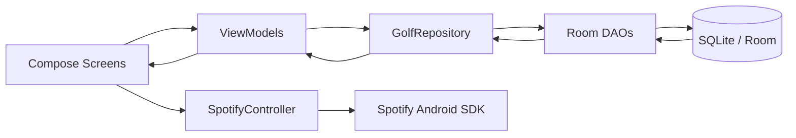

# Golf70 Trainer Architecture

## Module & Folder Structure

```text
Golf70-Trainer/
  app/
    src/main/java/com/golf70/trainer/
      data/local/            # Room entities, DAOs, database
      domain/                # Core models + seeded plans
      repository/            # Single source of truth and data orchestration
      session/               # Guided session engine ViewModel
      timer/                 # Reusable persistent drill timer ViewModel
      spotify/               # Spotify playback abstraction layer
      ui/
        navigation/          # Bottom navigation and route graph
        dashboard/           # Goal dashboard + analytics cards
        session/             # PracticeSessionScreen
        round/               # RoundTrackerScreen
        progress/            # Trends + recommendations
      util/                  # stats calculators, CSV helpers
  docs/ARCHITECTURE.md
```

## Main Modules

- **Data layer**: Room entities + DAO APIs for offline-first persistence.
- **Domain layer**: Session definitions, drill metric types, and stat models.
- **Repository layer**: Encapsulates DAO usage and exposes `Flow` streams to ViewModels.
- **Presentation layer**: Compose screens powered by lifecycle-aware ViewModels.
- **Integration layer**: Spotify controller wrapper around Spotify Android SDK APIs.

## Database Schema

### Tables

- `practice_sessions(id, dateEpochMillis, type, durationMinutes)`
- `drills(id, session_id, name, instructions, timerDurationSeconds, orderInSession)`
- `drill_results(id, drill_id, attempts, successes, shotDirection, distanceMeters, timestampEpochMillis)`
- `rounds(id, dateEpochMillis, course, score)`
- `hole_stats(id, round_id, holeNumber, score, fairwayHit, gir, putts, penalty)`
- `goals(id=1, targetScore, targetFairwayPercent, targetGirPercent, targetPuttsPerRound)`

### Relationships

- One `practice_session` has many `drills`
- One `drill` has many `drill_results`
- One `round` has many `hole_stats`

## ViewModel Design

- `MainViewModel`: aggregates dashboard KPIs from analytics queries.
- `PracticeSessionViewModel`: guided session sequencing, drill logging, result persistence.
- `DrillTimerViewModel`: lifecycle-resilient countdown/pause/resume/reset state.
- `RoundTrackerViewModel`: per-hole editing, summary calculations, round persistence.

## Navigation

Bottom nav with 4 root destinations:

1. `Dashboard`
2. `Start Session`
3. `Log Round`
4. `Progress`

`NavHost` keeps each flow focused and fast for on-course interaction.

## Data Flow Diagram



## Example Flow Code

```kotlin
viewModelScope.launch {
    val sessionId = repository.saveSession(todayDefinition)
    timerViewModel.start(currentDrill.timerSeconds)
    repository.saveDrillResult(drillId, attempts, successes, direction, distance)
}
```
